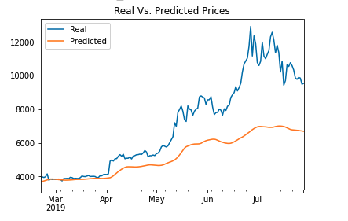
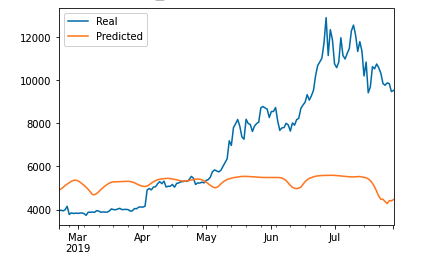

# LSTM Stock Predictor

## Preface

Investors use different ways to assess market sentiment in order to improve their trading strategies. This may include reviewing social media posts, news articles or the Fear and Greed (FNG) Index.

This assignment will utilise deep learning recurrent neural networks and FNG indicators to model Bitcoin closing prices.

We will evaluate deep learning models using both the simple closing prices and the FNG values to determine which provides a better signal for cryptocurrency trading. 

We will accomplish this by:

1. Preparing the data for training and testing
2. Building and training custom Long short-term memory (LSTM) Recurrent neural networks (RNN)
3. Evaluating the performance of each model

- - -

## Preparing the data for training and testing

* For the closing price model, I used previous closing prices to predict the next closing price.

* For the FNG price model, I used FNG indices to predict the next closing price.

* Each model I used 70% of the data for training and 30% of the data for testing.

* Finally, applied a MinMaxScaler to the X and y values to scale the data for the model.
 - - -

## Building and training custom Long short-term memory (LSTM) Recurrent neural networks (RNN)

For each model I used the following parameters to train and fit the model:
* window_size = 10
* number_units = 30
* dropout_fraction = 0.2
* epochs=10

* A deep Neural Network with three LSTMs with Dropouts and one Dense layer at the end.

### Evaluating the performance of each model

Which model has a lower loss?
* LSTM RNN using Close price has lower loss with 0.08 against the FNG model with a loss of  0.14.

Which model tracks the actual values better over time?
* The closing price model tracks the real price more closely than the FNG model. 

||
|:--:| 
| *Closing Model*|

||
|:--:| 
| *FNG Model*|

Which window size works best for the model?
* Window size of 5 provided better results for the closing model with a lower loss number